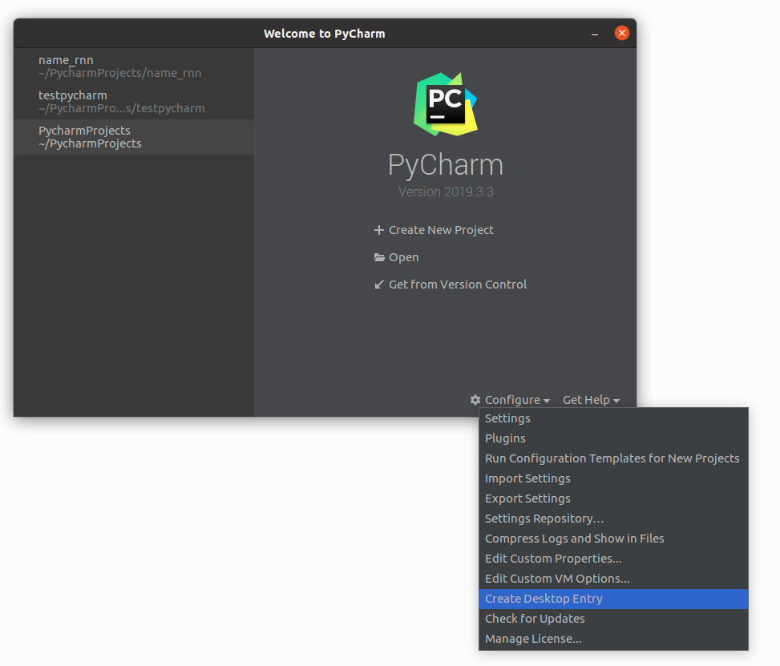
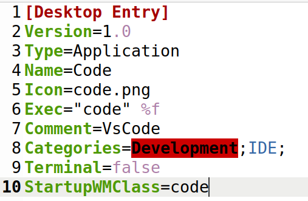

# myoptions: 自己的开发机器的配置

[TOC]

## 软件安装和配置

### 安装 ssh server
sudo apt-get install openssh-server

### 安装 vim 
sudo apt-get install vim

***推荐spf13配置[spf13](https://github.com/spf13/spf13-vim)**

### 安装git
sudo apt-get install git

### 安装 svn
sudo apt-get install subversion 

### 安装jdk1.8
- 1 下载jdk:[jdk8](http://www.oracle.com/technetwork/java/javase/downloads/jdk8-downloads-2133151.html)

tar -xf jdk-8u101-linux-x64.tar.gz

mkdir -p /usr/lib/jvm

mv jdk1.8.0_101 /usr/lib/jvm

- 2 添加下面几句到 /etc/profile

export JAVA_HOME=/usr/lib/jvm/jdk1.8.0_101   
export JRE_HOME=${JAVA_HOME}/jre    
export CLASSPATH=.:${JAVA_HOME}/lib:${JRE_HOME}/lib    
export PATH=${JAVA_HOME}/bin:$PATH

### 安装和配置zsh
- 1 安装zsh

sudo apt-get install zsh

- 2 配置oh-my-zsh

git clone https://github.com/robbyrussell/oh-my-zsh.git ~/.oh-my-zsh

- 3 修改默认shell

chsh -s /usr/bin/zsh   **不需要sudo**

### 安装teamviewer
sudo dpkg -i teamviewer_15.0.8397_amd64.deb

### 安装anaconda

### 安装vscode/IntelliJ_IDEA/pycharm
- 1 直接下载软件包，解压直接使用
- 2 idea和pycharm的专业版需要激活，网上找激活方法
- 3 配置桌面快捷启动
    * 3.1 创建Desktop Entry文件
        * 3.1.1 idea会在～/.local/share/applications创建jetbrains-idea.desktop，一般不用手动创建
        * 3.1.2 pycharm启动的时候,在configures下有Create Desktop Entry菜单，会在/usr/share/applications创建jetbrains-pycharm.desktop文件，如图,
        * 3.1.3 手动创建Desktop Entry文件(以vscode为例)

            * 在/usr/share/applications创建vscode.desktop文件，编辑内容如图)
            * 其中Icon是图标图片,Exec是执行的命令，修改成对应路径即可
            * StartupWMClass是为了启动多个窗口后，在同一个快捷图标下显示，获取方法如下：
                * 在终端写入这条命令 xprop WM_CLASS 并回车， 此时鼠标变成 + 的形状，点击应用的窗口
                * 终端上会自动输出WM_CLASS(STRING) = "code", "Code"
                * StartupWMClass=code

    * 3.2 创建好Desktop Entry文件后，可以在系统搜索中找到相应的app图标，右键"Add to Favorites"即可添加到快捷启动中

    ### 安装postman
    直接下载软件包，解压直接使用，配置桌面快捷启动参考上面说明

  